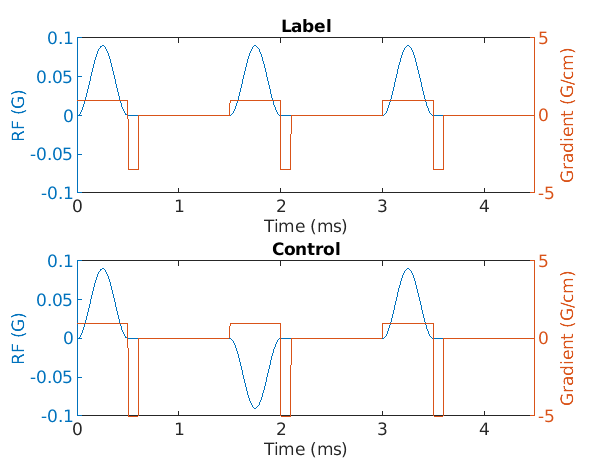
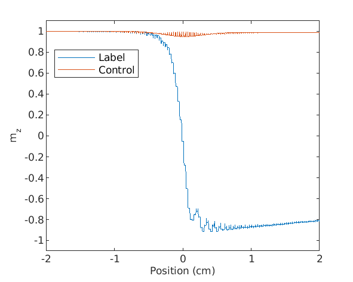

# pCASL Simulator

## Synopsis
Simulate flow-driven adiabatic inversion from pCASL, in 
[MATLAB](https://www.mathworks.com), as described in Dai et. al. 2008 
and Alsop et. al. 2015.

## Requirements
A [Bloch equation](https://github.com/SWastling/blochsim) simulator.

## Demonstration
This simulator can be used to model flow-driven adiabatic inversion using pCASL as 
shown in the [MATLAB demo](./flow_driven_adiabatic_inversion.m) and described below:

1. Define the gyromagnetic ratio:
    ```matlab
    gamma = 2.6753E8; % Proton gyromagnetic ratio (rad s-1 T-1)
    ```

2. Set the properties of blood:
    ```matlab
    v = 20;             % blood flow velocity (cm/s)
    t1 = 1.65;          % T1 of blood (from Alsop et. al. 2015)
    t2 = 0.25;          % T2 of blood (from Dai et. al. 2008)
    ```

3. Set the properties of the scanner:
    ```matlab
    g_max = 5;          % maximum gradient amplitude (G/cm)
    dt = 4;             % simulation time-step (us)
    ```

4. Set the properties of pCASL labelling:
    ```matlab
    pw_rfperf = 500;    % duration of the Hanning RF pulse (us)
    rfperf_sep = 1500;  % time between RF pulses (us)
    a_gzperf = 1.0;     % amplitude of the gradient (G/cm)
    gpav = 0.1;         % time average of the gradient (G/cm)
    b1pav = 0.015;      % time average of the RF (G)
    tlbl= 1800000;      % label duration (us)
    tag_dist = 0;       % distance from isocentre to labelling plane (cm)
    ```

5. Generate pCASL label and control RF and gradients using [pCASL_pulses](./pCASL_pulses.m) function: 
    ```matlab
    [b1_l, b1_c, g_l, g_c] = pCASL_pulses(g_max, dt, gamma, pw_rfperf, ...
    rfperf_sep, a_gzperf, gpav, b1pav, tlbl, tag_dist);
    ```
  
6. Plot the RF pulse and gradient waveform:
    ```matlab
    figure(1);
    % plot the first three pulses
    n_points_fig1 = 3 * rfperf_sep / dt;
    
    subplot(2, 1 ,1);
    t_fig1 = [1 : n_points_fig1] .* dt ./ 1000;
    yyaxis left
    plot(t_fig1, b1_l(1 : n_points_fig1));
    ylim([-0.1 0.1]);
    xlabel('Time (ms)');
    ylabel('RF (G)');
    
    yyaxis right
    plot(t_fig1, g_l(1 : n_points_fig1));
    ylim([-5 5]);
    xlabel('Time (ms)');
    ylabel('Gradient (G/cm)');
    title('Label')
    
    subplot(2, 1, 2);
    yyaxis left
    plot(t_fig1, b1_c(1 : n_points_fig1));
    ylim([-0.1 0.1]);
    xlabel('Time (ms)');
    ylabel('RF (G)');
    
    yyaxis right
    plot(t_fig1, g_c(1 : n_points_fig1));
    ylim([-5 5]);
    xlabel('Time (ms)');
    ylabel('Gradient (G/cm)');
    title('Control')
   ```
   
   
   
7. Perform Bloch simulation:
    ```matlab
    f = 0; % frequency offset of the spins in Hz
    
    % initial label magnetisation
    mx_l = 0;
    my_l = 0;
    mz_l = 1;
    
    % initial control magnetisation
    mx_c = 0;
    my_c = 0;
    mz_c = 1;
    
    mode = 0; % simulate from start recording on the final time point
    
    z_initial = tag_dist - 2; % initial spin position (cm)
    z_final = tag_dist + 2; % final spin position (cm)
    t = 0 : dt * 1E-6 : (z_final - z_initial) / v; % time vector (s)
    n_t = length(t);
    
    % only simulate the labelling in the period of interest as the spin crosses the labelling plane
    g_l = g_l(1 : n_t); 
    g_c = g_c(1 : n_t);
    b1_l = b1_l(1 : n_t);
    
    z = z_initial + v .* t; % spin positions
    r = zeros(n_t, 3); % column 1 is the x-position, column 2 is the y-position and column 3 the z-position
    r(:,3) = z;
    
    mx_l_arrary = zeros(1, n_t); % vector to store the label x-magnetisation
    my_l_arrary = zeros(1, n_t); % vector to store the label y-magnetisation
    mz_l_arrary = zeros(1, n_t); % vector to store the label z-magnetisation
    g_l_xyz = zeros(n_t, 3);
    g_l_xyz(:,3) = g_l;
    
    mx_c_array = zeros(1, n_t); % vector to store the control x-magnetisation 
    my_c_array = zeros(1, n_t); % vector to store the control y-magnetisation
    mz_c_array = zeros(1, n_t); % vector to store the control z-magnetisation
    g_c_xyz = zeros(n_t, 3);
    g_c_xyz(:,3) = g_c;
    
    fprintf(1, 'Bloch Simulation: 000%%');
    for ii=1 : n_t
        
        % determine mx,my and mz based on mx,my and mz at the previous time point
        [mx_l, my_l, mz_l] = bloch(b1_l(ii), g_l_xyz(ii, :), dt * 1E-6, t1, t2, f, r(ii, :), mode, mx_l, my_l, mz_l); 
        mz_l_arrary(ii) = mz_l;
        mx_l_arrary(ii) = mx_l;
        my_l_arrary(ii) = my_l;
        
        % determine mx,my and mz based on mx,my and mz at the previous time point
        [mx_c, my_c, mz_c] = bloch(b1_c(ii), g_c_xyz(ii, :), dt * 1E-6, t1, t2, f, r(ii, :), mode, mx_c, my_c, mz_c); 
        mz_c_array(ii) = mz_c;
        mx_c_array(ii) = mx_c;
        my_c_array(ii) = my_c;
    
        fprintf(1, '\b\b\b\b%03d%%', int64(100 .* ii ./ length(g_l)));
    end
    fprintf(1, '\n');
    
    % plot the longitudinal magnetisation as a function of position
    figure(2);
    plot(r(:, 3), mz_l_arrary, r(:, 3), mz_c_array)
    legend('Label', 'Control')
    ylim([-1.1 1.1])
    ylabel('m_z')
    xlabel('Position (cm)')
    ```

   

## License
See [MIT license](./LICENSE).

## References
1. [Dai et. al. Continuous Flow-Driven Inversion for Arterial Spin Labeling Using Pulsed 
Radio Frequency and Gradient Fields MRM 60:1488–1497 (2008)](./Dai_2008.pdf)

2. [Alsop et. al. Recommended Implementation of Arterial Spin-Labeled Perfusion 
MRI for Clinical Applications: A Consensus of the ISMRM Perfusion Study Group 
and the European Consortium for ASL in Dementia MRM 73:102–116 (2015)](./Alsop_2015.pdf) 


## Authors and Acknowledgements
Written by [Dr Stephen Wastling](mailto:stephen.wastling@nhs.net). Using a 
Bloch equation simulator, written by 
[Professor Brian A. Hargreaves](mailto:bah@stanford.edu) previously freely 
shared on his, now unavailable, webpage http://www-mrsrl.stanford.edu/~brian/blochsim.